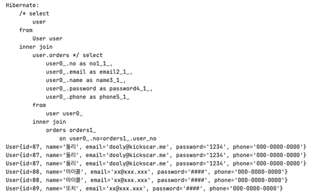
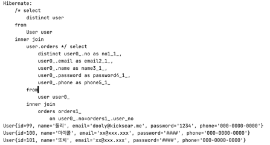
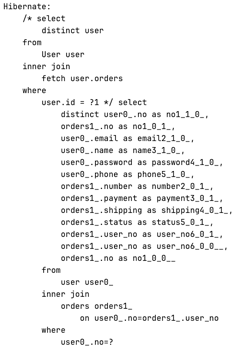

## 3. ex03.repository.UserRepository: based on QueryDSL with Spring Data JPA


#### 테스트 01: testSave

1. 기본 메소드 CrudRepository.save(s)

#### 테스트 02: testUpdate

1. repository.querdsl.QuerydslUserRepository.update(user)
2. QueryDSL 기반 메소드 직접 구현하고 JpaUserRepository 인터페이스와 통합

#### 테스트 03: testFindOrderById
1. 쿼리 메소드 findOrderById(id)
2. List<Order> 반환을 기대하지만 사실 User 엔티티 객체를 반환 받음
3. LAZY 모드가 기본이기 때문에 반환받은 User 엔티티 객체의 Order List는 Proxy 객체로 실제 Order가 담긴 List가 아니다. orders.size() 또는 orders.get(0) 등, List에 있는 Orders 객체에 접근할 때 쿼리가 실행
4. Join으로 Fetch 하지 않음. Fetch Mode를 EAGER로 바꾸면 Join 실행
5. 기본 Lazy 모드에서는 User 영속 엔티티 객체를 먼저 반환 받고 Order List는 Lazy 로딩
6. View 계층에서 Order List를 참조해야 하는 경우 spring.jpa.open-in-view 속성을 true로 설정해야 하는 한다. 

#### 테스트 04: testFindOrdersById
1. 테스트 03: testFindOrderById와 동일
2. 쿼리 메소드 findOrderById(id)를 정의보다는 테스트 코드처럼 사용하는 것이 맞다.

#### 테스트 05: testFindAllCollectionJoinProblem

1. repository.querdsl.QuerydslUserRepository.findAllCollectionJoinProblem()
2. OneToMany Collection Join(inner, outer, fetch)에서 발생하는 문제 테스트
3. 기본메소드 findAll()과 같지만, Order 엔티티와의 Collection Join(inner join) 테스트
4. assert에도 있지만, user 카운트가 order 카운트와 같아지는 문제가 있다.

    

   1) User와 Orders가 조인되었기 때문에 연결된 Orders의 개수만큼 User도 나오는 것이 당연하다.
   2) 이는 따지고 보면 문제가 아니다.

#### 테스트 06: testCollectionJoinProblemSolved



1. repository.querdsl.QuerydslUserRepository.findAllCollectionJoinProblemSolved()
2. Collection Join 문제 해결은 의외로 간단하다. distinct를 사용한다. QueryDSL에서는 selectDistinct()를 사용한다.
3. OneToMany Collection join 에는 반드시 selectDistinct()를 사용한다.


#### 테스트 07: testNplusOneProblem

1. N+1 문제를 테스트 한다.
2. 첫 번째 테스트는 User의 개별 Order수를 모두 더해 전체 order 수와 같은가 확인해 보는 결과가 뻔한 테스트다.
3. 두 번째 테스트는 전체 쿼리 실행 수가 전체 User를 가져오기 위한 쿼리수(1)와 각 User별로 Order를 가져오기 위해 실행된 쿼리수(N, countUsers)의 합이 같은가 이다.
4. 각 User 별로 Order List를 가져오기 위해 쿼리가 실행될 것을 예상할 수 있는 것이 중요하다.
   1) Lazy 때문에 User 엔티티 객체의 Order List는 Proxy 객체로 실제 Orders가 담긴 List가 아니다.
   2) Proxy 객체이면 orders.size() 또는 orders.get(0) 등, List에 있는 Order 객체에 접근할 때 쿼리가 실행될 것이기 때문에 쿼리수를 카운팅을 할 수 있다.
   3) 다음은 프락시 객체 초기화 상태을 체크하는 코드다.

      ```
      if(!em.getEntityManagerFactory().getPersistenceUnitUtil().isLoaded(orders)){
         qryCount++;
      }
                    
      ```
      
   4) PersistenceUnitUtil.isLoaded(Entity) 반환이 false이면 초기화 되지 않은 Proxy객체이며 지연로딩 중인 것이다.
   5) 테스트 결과는 N+1번으로 쿼리가 실행된 것을 확인할 수 있다.(쿼리 로그에서 셀 수도 있다.)

#### 테스트 08: testNplusOneProblemNotSolvedYet

1. 테스트 06의 Collection Join 문제(다중row)를 해결한 findAllCollectionJoinProblemSolved()를 사용해 보는 테스트이다.
2. N+1번 쿼리가 실행되기 때문에 다중 row만 해결할 수 있고 N+1문제는 아직 해결하지 않았다.

#### 테스트 09: testNplusOneProblemSolved

1. N+1 문제를 해결한 repository.querdsl.QuerydslUserRepository.findAllCollectionJoinAndNplusOneProblemSolved() 테스트
2. 이름은 길지만 innerJoin() + fetchJoin() 으로 작성된 QueryDSL 컬렉션 페치조인을 하는 메소드이다.
3. 테스트 통과 조건인 1번 쿼리수가 나온다.
4. join은 Lazy가 무시되기 때문에 Proxy 객체를 사용하지 않는다.
5. OneToMany에서 객체 그래프의 컬렉션 페치에서 발생하는 다중 Row 문제와 N+1 Lazy 로딩 문제를 해결하기 위해서는 selectDistinct(), fecthJoin()을 사용한다.
6. 참고로 Lazy로 객체그래프의 컬렉션 접근이 성능에 문제가 있는 것은 아니다. 
   1) 상황에 따라 적용을 다르게 해야 한다는 것을 기억
   2) 실무에서는 Global Fetch 전략은 보통 LAZY이다.
   3) N+1 문제는 LAZY, EAGER가 공통으로 가지고 있다.
   4) N번 쿼리의 발생은 막는 것이 아니고 해야할 때와 하지 말아야 할 때를 구분하는 것
   5) 'N번 쿼리가 언제 일어나는가?'를 알고 전략적으로 사용하면 캐쉬 효과로 오히려 조인보다 성능 향상을 기대할 수 있다.
   6) 지연로딩을 해도 상관없는 비즈니스나 뷰에다가 EAGER 설정으로 인한 N번 쿼리 발생을 인지 못하는 것이 더 위험하다.


#### 테스트 10: testFindOrderByIdFinal

1. repository.querdsl.QuerydslUserRepository.findOrdersByNo(id) 테스트
2. 최적화된 repository.querdsl.findAllCollectionJoinAndNplusOneProblemSolved() 기반으로 특정 사용자의 주문 내역을 조회하는 메소드다
   
   
            
   1) 쿼리를 보면 만족스럽다.
   2) fetch join을 사용했기 프로젝션을 할 수 없다.
   3) 객체 그래프(getOrders())를 사용하여 List<Order> 자체를 반환하기 때문에 페이징 Pagination API가 아무 의미가 없고 사용하면 무시된다. 
   4) 페이징이 필요하다면 반대편 ManyToOne Orders Repository에서 하자. 이 것이 자연스럽고 구현도 가능하다.(Orders Repository 구현 참고)

#### 테스트 11: cleanUp
1. 테스트에 사용한 User, Order를 모두 삭제한다.
2. 쿼리 로그 확인해 볼 것$